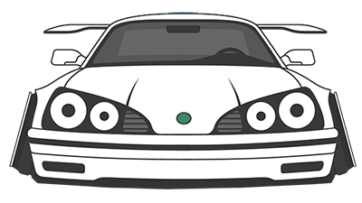

<p align="center"></p>

*Notice*: This project is original version of **vircar**. The change of name occured on 
12/04/17.

## virtualcar 
**virtualcar** (**vir**-tual-**car**) is a CAN-based wrapper written in C, that acts as 
a virtual car. The core is listening to the virtual CAN device and parse, analyze and 
transmit signal from nodes to nodes, or in other way manipulate with request.
  
This software is licensed under GNU General Public V3 license. Please, keep the software 
open source and contribute to the project if you want.
  
The project is developed on top of SocketCAN module and therefore requires Linux based 
system. I am currently rewriting the SocketCAN module for MacOS and you may fork the 
repository from [duraki/socketcanx](https://github.com/duraki/socketcanx).
  
## a car? really?
Yes! A fully, functional car.  
Well, not really no. It does represent a car/vehicle but in a limited spirit and form. I was 
writing a post about [cyber-attacks](https://duraki.github.io/posts/o/20160326-napadi-na-auto-sistem-1.html) 
on a vehicle systems and [another one](https://duraki.github.io/posts/o/20160327-cyber-attacks-on-vehicles-2.html) 
that show **virtualcar** in action, and didn't have necessary (hardware) equipment to test 
the techniques, so I wrote this to let myself experiment a bit.   
  
So a few months passed, and I talked about this little code on a BalCCon 2k16 where I 
offered a small introduction to these cyber-attacks, plus you could buy me a drink and 
I'd tell you some secrets. So I renamed this project and I'll try to develop some nodes 
as per request in Issues board. Meanwhile, I'd appreciate pull requests that make sense.
   
## functionality
Currently, **virtualcar** offers several different controllers or nodes that understand a 
particular signal and either accept or reject the CAN frame. I'm implementing both data 
frames and RTR. The RTR has some basic functions like asking for value of an instrument.
  
**virtualcar** nodes:
* `NODE_SIGNAL_DOOR_MODE` - Door actions
* `NODE_SIGNAL_EHPS_MODE` - EHPS actions
  
**TODO** nodes (*@see* `nodes.h`):  
* `NODE_SIGNAL_INST_MODE`
* `NODE_SIGNAL_ENGN_MODE`
* `NODE_SIGNAL_MABS_MODE` 
* `NODE_SIGNAL_MESP_MODE`
* `NODE_SIGNAL_AIRB_MODE`
* `NODE_SIGNAL_NAVG_MODE` 
* `NODE_SIGNAL_TRNC_MODE`
  

## virtualcar-web
I'm sorry, the virtualcar-web is being developed and there is some kind of version floating 
as a private repository and a submodule in this repo. Anyway, virtualcar-web should be 
used as web-interface to manipulate with virtualcar daemon. It's written in Rails and 
support some interesting things but more about that inside [virtualcar-web](https://github.com/duraki/virtualcar-web) 
repository and README file.

```
$ git submodule init
Submodule 'virtualcar-web' (...) registered for path 'virtualcar-web'

$ git submodule update
Cloning into 'virtualcar-web'...
...
```
  
To update or fetch the `virtualcar-web` project:
  
```
$ cd virtualcar/virtualcar-web
$ git fetch
...

$ git merge origin/master
``` 
  
## requirements
I love to write pure native scripts. The only requirement for now is that you are running 
under **GNU Linux** and have **can-utils** installed on your system.  

* gcc
* linux kernel (can.h)
* can-utils
  
## compile & running

To clone the repo and compile it from source: 

	$ git clone https://github.com/duraki/virtualcar.git
	$ cd virtualcar 
	$ make
	$ chmod 777 virtualcar 

To run **virtualcar** use sudo (entirely for CAN bus device linking)	

	$ sudo ./virtualcar
	Welcome to vir(tual) car.
	~
	=========================================
	https://github.com/duraki/virtualcar

	# waiting for operation

To **exit** vircar use Ctrl+C.  
To **kill** a car and remove protocol use:
	
	$ ./virtualcar k
	ka-boom, pfw, aaa, ts
	*car exploded*

## outro
If you are interested in car hacking, write me on [twitter](https://twitter.com/0xduraki). 
Any additional options and CAN nodes should be accepted if they follow RTR or Accept/Desctruct
operation. Please, keep the code and project with clean lines of code. 
  
